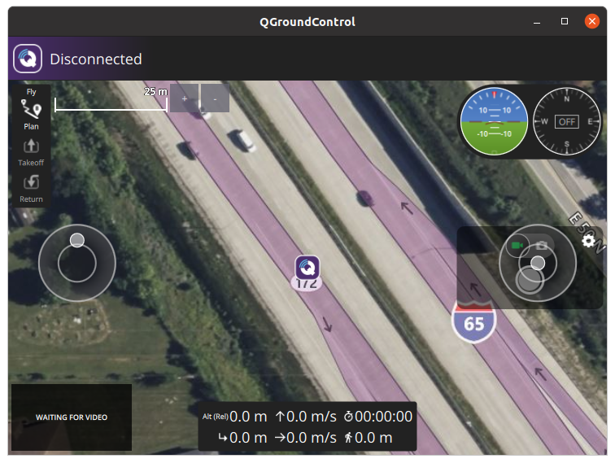
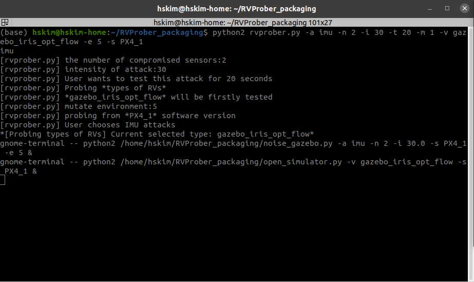
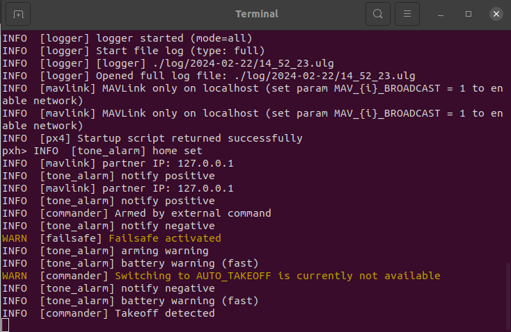
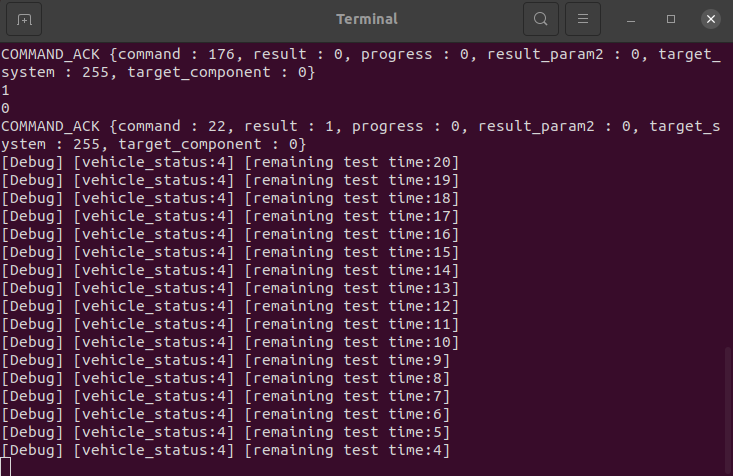
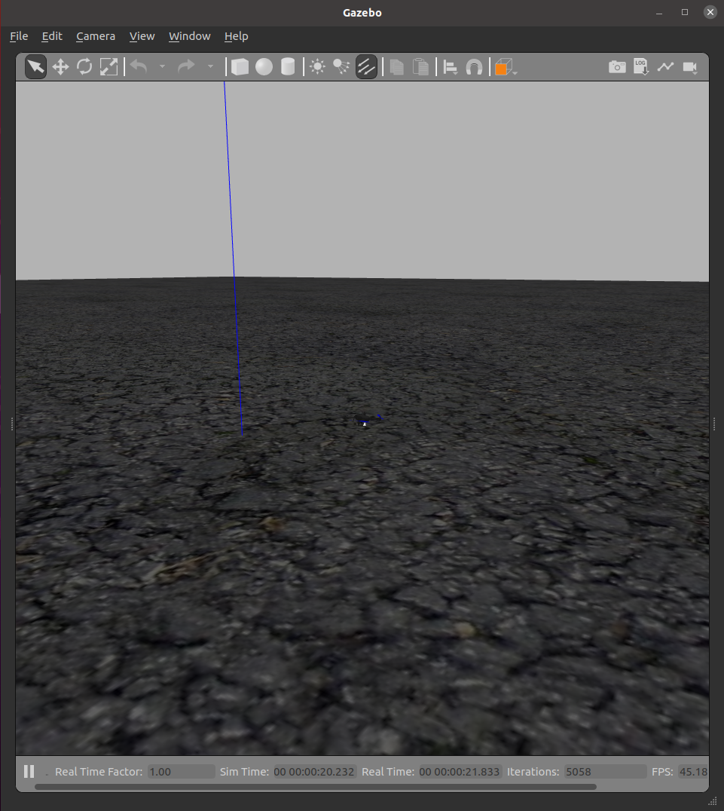

# RVProber for PX4
# 1. Introduction
RVProber is an attack prerequisite analysis framework. Many of the ideas behind RVProber are documented in a paper published at IEEE S&P 2024. Please refer to <a href="https://kimhyungsub.github.io/S&P24_hskim.pdf" target="_blank"> this</a>.

The below demo video shows that RVProber simulates acoustic noise injection attacks for different types of RVs. 
<iframe width="862" height="345" src="https://youtu.be/Qi3HTCpCK-w">
</iframe>

# 2. Preparation
## 2-1. Parsing valid ranges of configuration parameters
When RVProber tests a physical sensor attack with different configuration parameters, RVProber needs to know the valid ranges of the parameters defined by PX4 developers. The Python script in the following link automatically parses and extracts the valid ranges.
Please refer to <a href="https://github.com/purseclab/PGFuzz/tree/main/PX4/xml_parse" target="_blank"> this</a>.

RVProber already knows the valid ranges of the configuration parameters related to sensor fusion algorithms (i.e., EKF). If you want to test additional configuration parameters, you can copy and paste the extracted valid ranges into "list_of_params.txt".

## 2-2. Download multiple versions of PX4
'setup.sh' downloads PX4 versions from v.1.12.0 to v.1.15.0. 
```bash
cd ~/RVProber/PX4/
./setup.sh
```

If you want to update other PX4 versions, please modify the code lines in 'setup.sh'.
```bash
declare -a version=("px4_1_15_0" "px4_1_14_1" "px4_1_14_0" "px4_1_13_3" "px4_1_13_2" "px4_1_13_1" "px4_1_13_0" "px4_1_12_3" "px4_1_12_2" "px4_1_12_1" "px4_1_12_0")

declare -a commit=("3ad2c64" "beb834a" "b8c541d" "1c8ab2a" "46a12a0" "dc7f29e" "6823cbc" "2e8918d" "ba0b512" "1682fd5" "9524e8e")
```

## 2-3. Setup environment variables
You need to point to RVProber and PX4 directories. <br>
🛑 Please do not simply copy and paste the below commands. You need to update the paths according to where you downloaded RVProber and PX4.
```bash
export RVPROBER_PX4_HOME=/home/hskim/RVProber/RVProber_PX4/
export PX4_HOME=/home/hskim/PX4/px4_1_15_0/
export PX4_1=/home/hskim/PX4/px4_1_15_0
export PX4_2=/home/hskim/PX4/px4_1_14_1
export PX4_3=/home/hskim/PX4/px4_1_13_3
export PX4_4=/home/hskim/PX4/px4_1_13_2
export PX4_5=/home/hskim/PX4/px4_1_13_1
export PX4_6=/home/hskim/PX4/px4_1_13_0
```

# 3. Executing RVProber
## 3-1. Check whether PX4 works well on your environment
```bash
cd [PX4 directory]
make clean
make distclean
make px4_sitl gazebo
```

## 3-2. Execute RVProber
### Open QGroundControl to create RC inputs


### Commandline to test different types of RVs
```
cd [RVProber directory]
python2 rvprober.py -a imu -n 1 -i 10 -t 20 -m 1 -v gazebo_iris_opt_flow -e 5 -s PX4_1
```

### Commandline to test different hardware configurations
```
python2 rvprober.py -a imu -n 1 -i 10 -t 20 -m 2 -v gazebo_iris_opt_flow -e 5 -s PX4_1
```

### Commandline to test flight modes
```
python2 rvprober.py -a imu -n 1 -i 10 -t 20 -m 4 -v gazebo_iris_opt_flow -e 5 -s PX4_1
```

### Commandline to test different software versions
```
python2 rvprober.py -a imu -n 1 -i 10 -t 20 -m 5 -v gazebo_iris_opt_flow -e 5 -s PX4_1
```

### Commandline to test different configuration parameters
```
python2 rvprober.py -a imu -n 1 -i 10 -t 20 -m 6 -v gazebo_iris_opt_flow -e 5 -s PX4_1
```

### Commandline to test different environmental conditions
When you input '2_5' [unit_iterations] as the parameter for '-e'. RVProber tests the following intensity of the changed environmental conditions: 2, 4, 6, 8, 10.
```
python2 rvprober.py -a imu -n 1 -i 10 -t 20 -m 7 -v gazebo_iris_opt_flow -e 2_5 -s PX4_1
```


Details of command options:
```commandline
-a: An attack <gps|imu|mag|baro|opticalflow|EMI>
-n: The number of compromised sensor <from 1 to 3>
-i: Intensity of attack <value>
    When you select a value, it multiplies the intensity of the attack.  
-t: Test duration (unit: second)
-m: Probing target 
  1: Probing *types of RVs*
  2: Probing *hardware configurations*
  4: Probing *flight modes*
  5: Probing *software versions*
  6: Probing *configuration parameters*
  7: Probing *environmental conditions*
  10: Probing *all preconditions*
-v: Choose which vehicle type must be firstly tested <gazebo_iris_opt_flow|gazebo_rover|gazebo_uuv_hippocampus>
-s: Choose from which software version must be tested
-e: Mutate environment (e.g., wind speed and wave speed)
```

### For each test iteration, RVProber opens (1) two terminal windows and (2) Gazebo simulator.

#### Terminal window for executing RVProber


#### Terminal window for Gazebo
It is for monitoring the Gazebo simulator.<br>


#### Terminal window for mutating prerequisites 
It is for mutating prerequisites.<br>


#### Gazebo 
It is the executed Gazebo simulator.<br>


